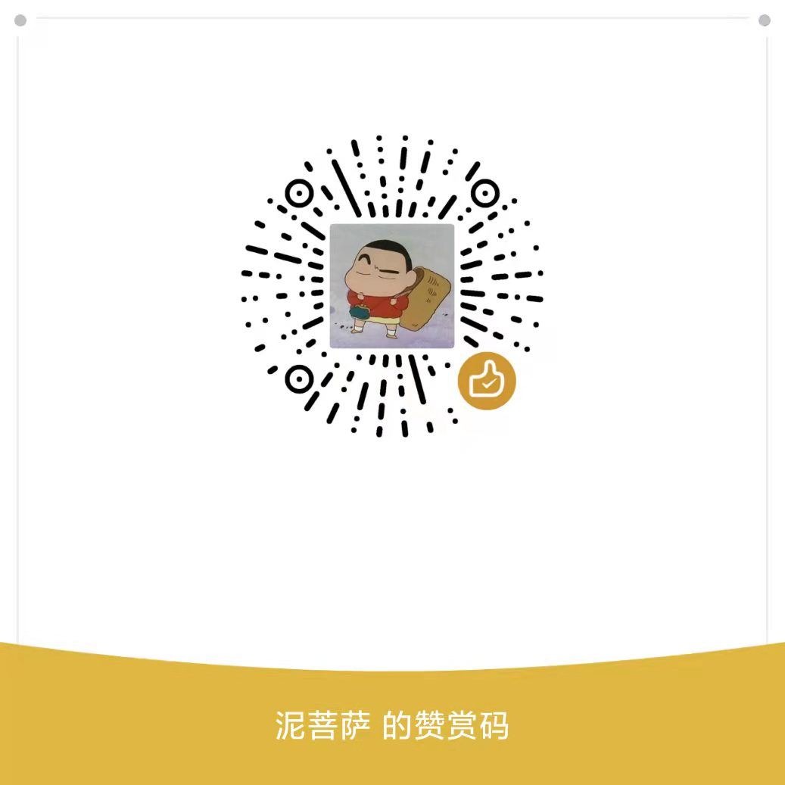

# MicroPython Home Assistant integration 🏠

MHA allows to integrate an Micropython based device with Home Assistant using MQTT.

## Features

* Two-way communication (state reporting and command execution)
* MQTT discovery (device is added to the Home Assistant panel automatically)
* MQTT Last Will and Testament
* Support for custom MQTT messages (publishing and subscribing)
* Auto reconnect with MQTT broker
* Reporting availability (online/offline states) of a device

## Supported HA types

| Home Assistant type     | Supported |
| ----------------------- | :--------: |
| [Alarm control panel][] |     ❌     |
| [Binary sensor][]       |     ✅     |
| [Button][]              |     ❌     |
| [Camera][]              |     ❌     |
| [Cover][]               |     ❌     |
| [Device tracker][]      |     ❌     |
| [Device trigger][]      |     ❌     |
| [Event][]               |     ❌     |
| [Fan][]                 |     ❌     |
| [Humidifier][]          |     ❌     |
| [Image][]               |     ❌     |
| [HVAC][]                |     ❌     |
| [Lawn mower][]          |     ❌     |
| [Light][]               |     ❌     |
| [Lock][]                |     ❌     |
| [Number][]              |     ❌     |
| [Scene][]               |     ❌     |
| [Select][]              |     ❌     |
| [Sensor][]              |     ❌     |
| [Siren][]               |     ❌     |
| [Switch][]              |     ❌     |
| [Update][]              |     ❌     |
| [Tag scanner][]         |     ❌     |
| [Text][]                |     ❌     |
| [Vacuum][]              |     ❌     |
| [Valve][]               |     ❌     |
| [Water heater][]        |     ❌     |

[Alarm control panel]: https://www.home-assistant.io/integrations/alarm_control_panel.mqtt/
[Binary sensor]: https://www.home-assistant.io/integrations/binary_sensor.mqtt/
[Button]: https://www.home-assistant.io/integrations/button.mqtt/
[Camera]: https://www.home-assistant.io/integrations/camera.mqtt/
[Cover]: https://www.home-assistant.io/integrations/cover.mqtt/
[Device tracker]: https://www.home-assistant.io/integrations/device_tracker.mqtt/
[Device trigger]: https://www.home-assistant.io/integrations/device_trigger.mqtt/
[Event]: https://www.home-assistant.io/integrations/event.mqtt/
[Fan]: https://www.home-assistant.io/integrations/fan.mqtt/
[Humidifier]: https://www.home-assistant.io/integrations/humidifier.mqtt/
[Image]: https://www.home-assistant.io/integrations/image.mqtt/
[HVAC]: https://www.home-assistant.io/integrations/climate.mqtt/
[Lawn mower]: https://www.home-assistant.io/integrations/lawn_mower.mqtt/
[Light]: https://www.home-assistant.io/integrations/light.mqtt/
[Lock]: https://www.home-assistant.io/integrations/lock.mqtt/
[Number]: https://www.home-assistant.io/integrations/number.mqtt/
[Scene]: https://www.home-assistant.io/integrations/scene.mqtt/
[Select]: https://www.home-assistant.io/integrations/select.mqtt/
[Sensor]: https://www.home-assistant.io/integrations/sensor.mqtt/
[Siren]: https://www.home-assistant.io/integrations/siren.mqtt/
[Switch]: https://www.home-assistant.io/integrations/switch.mqtt/
[Update]: https://www.home-assistant.io/integrations/update.mqtt/
[Tag scanner]: https://www.home-assistant.io/integrations/tag.mqtt/
[Text]: https://www.home-assistant.io/integrations/text.mqtt/
[Vacuum]: https://www.home-assistant.io/integrations/vacuum.mqtt/
[Valve]: https://www.home-assistant.io/integrations/valve.mqtt/
[Water heater]: https://www.home-assistant.io/integrations/water_heater.mqtt/

## Examples

| Example                                    | Description                                       |
| ------------------------------------------ | ------------------------------------------------- |
| [Binary sensor](examples/binary_sensor.py) | Using the binary sensor as a door contact sensor. |

## Compatible platform

Here is the list of platform on which the library was tested:

- Micropython
- Python3

## Donate

If you think this project is helpful to you, you can donate to us to encourage the project to continue to develop and become more complete.

- PayPal

    

- WeChat

    

- Alipay

    
